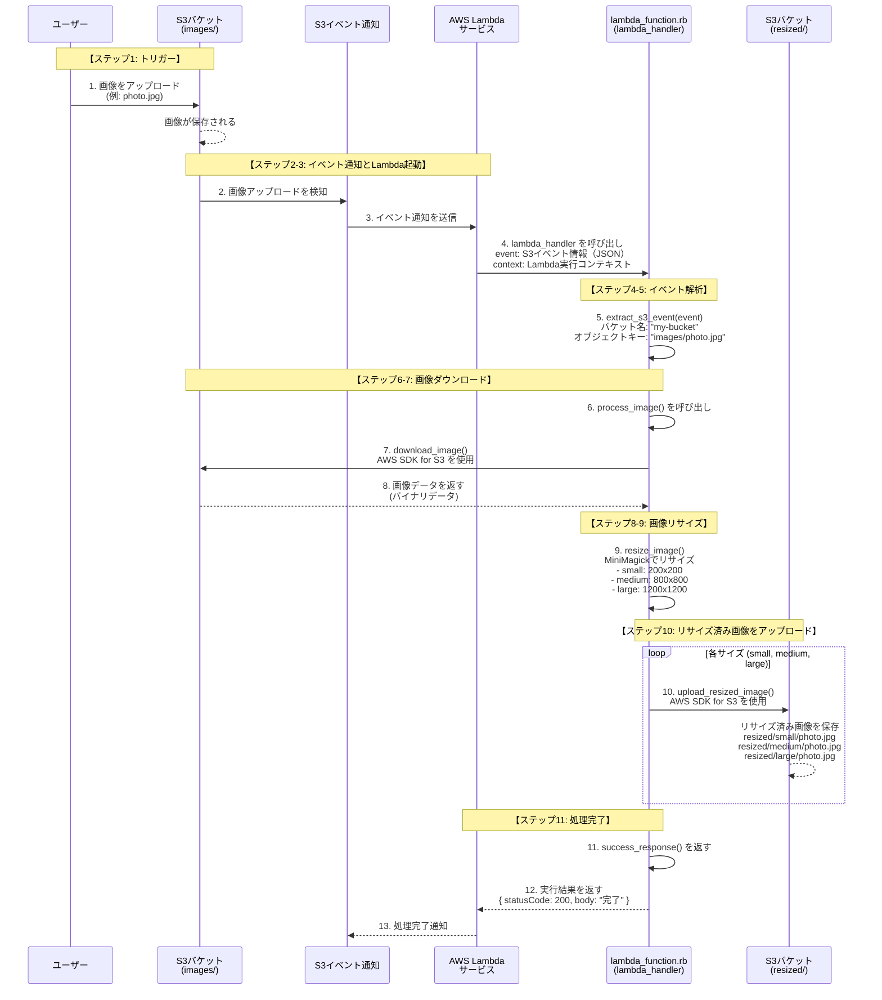

# Lambda画像リサイズサービス

AWS LambdaとS3を使用した画像自動リサイズサービスです。

## 📋 目次

1. [概要](#概要)
2. [アーキテクチャ](#アーキテクチャ)


## 概要

S3バケットに画像がアップロードされると、自動的に以下の3サイズにリサイズします：

- **small**: 200x200px（サムネイル）
- **medium**: 800x800px（中サイズ）
- **large**: 1200x1200px（大サイズ）

リサイズ済み画像は `resized/` フォルダに保存されます。

## アーキテクチャ

```
S3 (images/) → Lambda関数 → S3 (resized/)
```

1. ユーザーがS3の `images/` フォルダに画像をアップロード
2. S3イベント通知がLambda関数をトリガー
3. Lambda関数が画像をダウンロードしてリサイズ
4. リサイズ済み画像を `resized/` フォルダに保存

## 通信と処理の流れ（詳細図）



## コスト見積もり

- **Lambda**: 100万リクエスト/月まで無料
- **S3**: 5GB保存で約150円/月
- **CloudWatch Logs**: 5GBまで無料

**合計**: 月200-500円程度（小規模利用の場合）

## 参考資料

- [AWS Lambda Ruby ランタイム](https://docs.aws.amazon.com/lambda/latest/dg/lambda-ruby.html)
- [MiniMagick ドキュメント](https://github.com/minimagick/minimagick)
